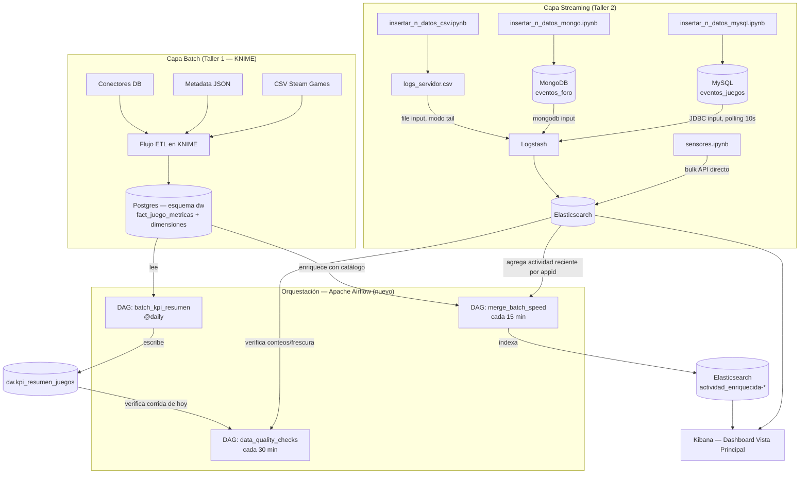

# Arquitectura del proyecto

## Visión general

El proyecto implementa un **patrón Lambda simplificado**: una capa batch, una capa de
velocidad (streaming / near real-time), y una capa de integración/servicio que las
combina. No se construyó desde cero — se reutiliza deliberadamente la infraestructura
de los talleres anteriores del curso, y el trabajo nuevo de este proyecto es la capa
de **orquestación con Apache Airflow** que conecta ambos mundos.

| Capa | Origen | Estado |
|---|---|---|
| Batch (catálogo de juegos Steam) | Taller 1 — ETL en KNIME → `dw.fact_juego_metricas` + dimensiones | Reutilizado, ya poblado |
| Streaming / near real-time (4 fuentes) | Taller 2 — Logstash + Python/Faker → Elasticsearch | Reutilizado, generadores en `generadores/` |
| Orquestación y merge batch+speed | **Nuevo en este proyecto** — Apache Airflow | `dags/` |
| Visualización | Kibana | Reutilizado (dashboard "Vista Principal") |

## Diagrama de flujo

## Justificación de cada tecnología

- **KNIME (Taller 1):** ETL visual para el catálogo estático de juegos Steam. No se
  reemplaza en este proyecto — sigue siendo la fuente batch inicial.
- **MySQL + MongoDB + archivo CSV + Python directo (Taller 2):** cuatro mecanismos de
  ingesta near real-time distintos, deliberadamente heterogéneos, para demostrar que
  Logstash puede consolidar orígenes muy distintos en un solo destino (Elasticsearch).
- **Logstash:** motor de ingesta near real-time vía polling (JDBC, mongodb, file
  input en modo tail). Corre nativo (no en Docker) por decisión del Taller 2.
- **Elasticsearch + Kibana:** almacenamiento y visualización de la capa de velocidad.
- **Apache Airflow (LocalExecutor):** orquestación de los procesos batch propios de
  este proyecto y, sobre todo, de la **integración** entre las dos capas — la pieza
  que no existía antes de este trabajo final.

## Por qué Airflow no reimplementa el ETL de KNIME

El enunciado permite no usar todas las herramientas revisadas, y reimplementar en
Python lo que KNIME ya resuelve correctamente sería trabajo redundante sin valor
añadido. En cambio, Airflow opera **sobre el resultado** de KNIME (la tabla de
hechos ya modelada) para (a) calcular KPIs agregados de forma programada
(`batch_kpi_resumen`) y (b) fusionarlos con la actividad en tiempo real
(`merge_batch_speed`) — ambas tareas que KNIME no hace y que sí requieren
orquestación programada.

## Los 3 DAGs

### 1. `batch_kpi_resumen` (batch puro)
Lee `dw.fact_juego_metricas` + `dim_genero` + `dim_fecha`, calcula promedios de
precio, % de reseñas positivas y tiempo de juego agrupados por género y por década,
y los escribe (upsert) en `dw.kpi_resumen_juegos`. Corre 1 vez al día.

**Tareas:** `crear_tabla_resumen` → [`kpis_por_genero`, `kpis_por_decada`] (paralelo)
→ `resumen_ejecucion`.

### 2. `merge_batch_speed` (integración Lambda)
Agrega actividad reciente por `appid` en Elasticsearch (últimos 15 min, fuentes
MySQL y MongoDB), la enriquece con atributos de catálogo desde Postgres (nombre,
género, precio, metacritic_score), y reindexa el resultado combinado en
`actividad_enriquecida-*`. Corre cada 15 minutos.

**Tareas:** `extraer_actividad_streaming` → `enriquecer_con_catalogo` →
`cargar_a_elasticsearch`.

### 3. `data_quality_checks` (validación)
Verifica que los 5 índices streaming sigan recibiendo datos (conteo creciente,
timestamp reciente) y que `batch_kpi_resumen` haya corrido hoy. Consolida un
reporte y falla visiblemente en la UI de Airflow si detecta 2+ problemas
simultáneos. Corre cada 30 minutos.

**Tareas:** [`verificar_conteos_indices`, `verificar_frescura_indices`,
`verificar_batch_kpi`] (paralelo) → `consolidar_reporte`.

## Decisiones técnicas relevantes

- **Postgres de metadatos separado del DW** (`postgres-airflow` vs `postgres-dev`):
  evita mezclar las tablas internas de Airflow con el esquema `dw` del proyecto.
- **LocalExecutor** en vez de CeleryExecutor: la carga de trabajo (3 DAGs, pocas
  tareas cada uno) no justifica la complejidad de workers distribuidos con Redis.
- **Airflow Connections** (`postgres_dw`) en vez de credenciales hardcodeadas en el
  código de los DAGs — las credenciales quedan centralizadas y fuera del control de
  versiones.
- **`_PIP_ADDITIONAL_REQUIREMENTS`** para las dependencias de los DAGs (pymongo,
  elasticsearch, psycopg2-binary, etc.): válido para desarrollo/pruebas; en un
  entorno productivo correspondería una imagen Docker propia (`Dockerfile`) con las
  dependencias fijadas.
